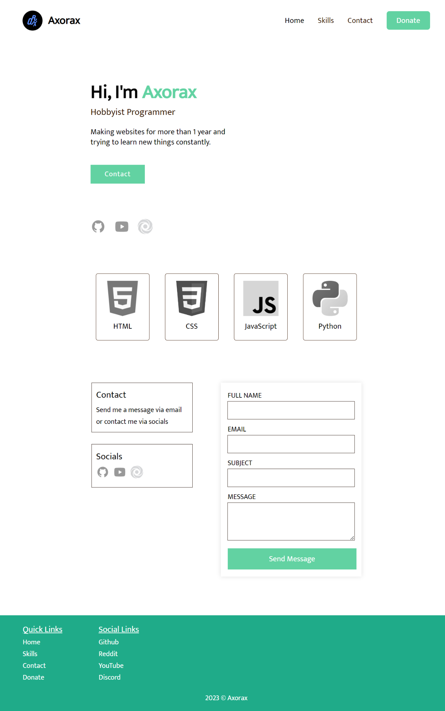
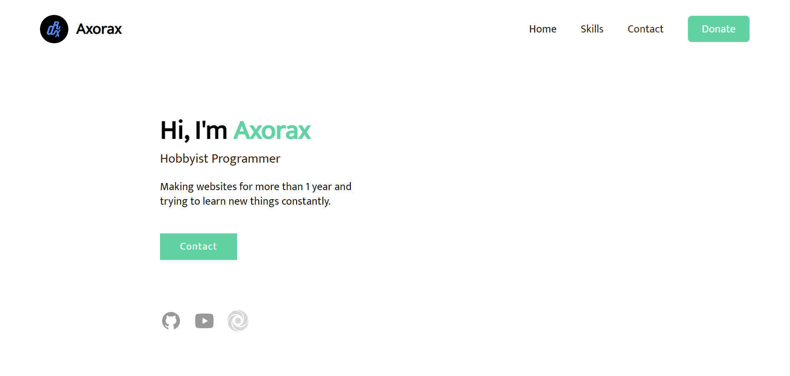
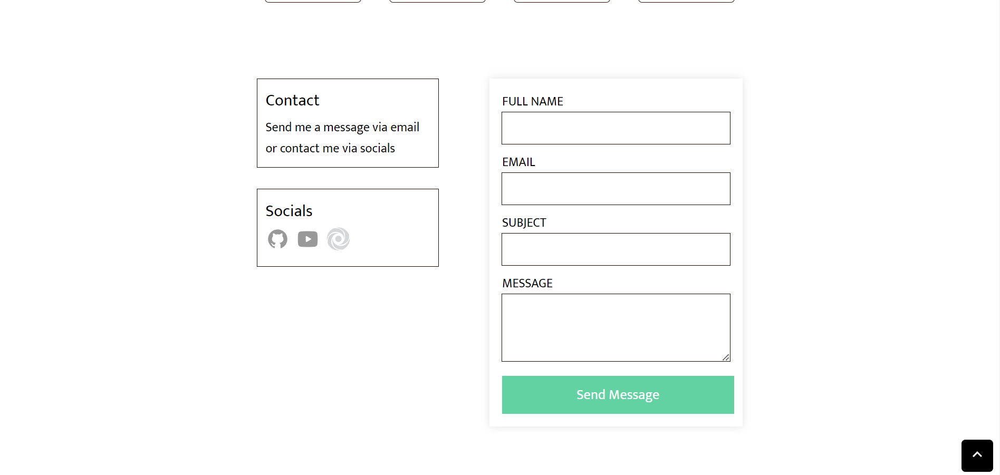
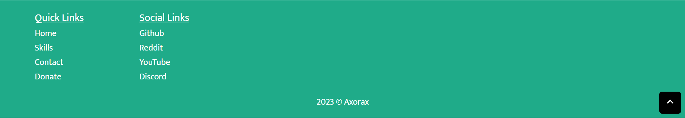

<h1 align="center">Portfolio website 2</h1>

A simple portfolio website I made in 1 hour for a contest with my friend. I also made a few changes after the 1 hour time limit :P

### Preview Images

View screenshot of each section individually

 

---

Color Palette

---

[Support me on Patreon](https://www.patreon.com/axorax) -
[Check out my socials](https://github.com/axorax/socials)
